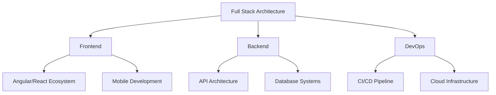

# 👨‍💻 Pasindu Chanaka

<div align="center">
  
  [](https://git.io/typing-svg)
  
  [](https://www.linkedin.com/in/pasindu-chanaka/)
  [](mailto:pasinduchanaka26@gmail.com)
  
  [](https://leetcode.com/pasinduchanaka)

</div>

## 💻 Tech Stack Blueprint



## 🎯 Professional Arsenal

```typescript
interface TechProfile {
  languages: Language[];
  frameworks: Framework[];
  architecture: string[];
  databases: Database[];
  cloud: Cloud[];
  tools: DevTools[];
}

const pasinduProfile: TechProfile = {
  languages: [
    { name: "TypeScript", level: "Expert", yearsOfExp: 5 },
    { name: "Golang", level: "Advanced", yearsOfExp: 3 },
    { name: "Java", level: "Expert", yearsOfExp: 6 },
  ],
  frameworks: [
    { name: "Laravel", expertise: ["API", "Authentication"] },
    { name: "React", expertise: ["Redux"] },
    { name: "Angular", expertise: ["NgRx", "RxJS", "Material"] },
    { name: "Spring Boot", expertise: ["Microservices", "Security"] },
  ],
  architecture: [
    "Microservices",
    "Event-Driven",
    "Domain-Driven Design",
    "CQRS Pattern"
  ],
  databases: [
    { type: "SQL", names: ["MySQL", "PostgreSQL"] },
    { type: "NoSQL", names: ["MongoDB", "Redis"] }
  ],
  cloud: ["AWS", "GCP", "Azure"],
  tools: ["Docker", "Kubernetes", "Jenkins", "Terraform"]
};
```

## 🚀 Expertise Breakdown

<details>
<summary>🎨 Frontend Engineering</summary>
<br>

### Core Technologies


### State Management & Reactive Programming


### Mobile Development


</details>

<details>
<summary>⚙️ Backend Architecture</summary>
<br>

### Core Frameworks


### Database Systems


### API Design


</details>

<details>
<summary>☁️ DevOps & Cloud</summary>
<br>

### Container Orchestration


### Cloud Platforms


### CI/CD & IaC


</details>

## 📊 Performance Metrics

<div align="center">


[](https://git.io/streak-stats)

[](https://github.com/pasinduchanaka)

</div>

## 🌟 Featured Projects

<details>
<summary>🚀 Enterprise Solutions</summary>

1. **Microservices Architecture Implementation**
   - Built scalable microservices using Spring Boot & Kubernetes
   - Implemented event-driven architecture with Apache Kafka
   - Achieved 99.99% uptime with zero-downtime deployments

2. **Cloud-Native E-commerce Platform**
   - Developed using Angular & Spring Boot microservices
   - Implemented CQRS pattern for scalability
   - Containerized with Docker & orchestrated using Kubernetes
</details>

## 📫 Professional Connect

I'm passionate about:
- 🎯 Microservices Architecture & Domain-Driven Design
- 🌱 Cloud-Native Applications & DevOps Practices
- 🔧 Performance Optimization & Scalability
- 🤝 Technical Leadership & Mentoring

Let's connect and discuss technology:
- 📧 [pasinduchanaka26@gmail.com](mailto:pasinduchanaka26@gmail.com)
- 💼 [LinkedIn](https://www.linkedin.com/in/pasindu-chanaka/)
- 💻 [GitHub](https://github.com/pasinduchanaka)

<div align="center">

### "First, solve the problem. Then, write the code." – John Johnson

---
[](https://www.buymeacoffee.com/pasinduchanaka)

</div>
